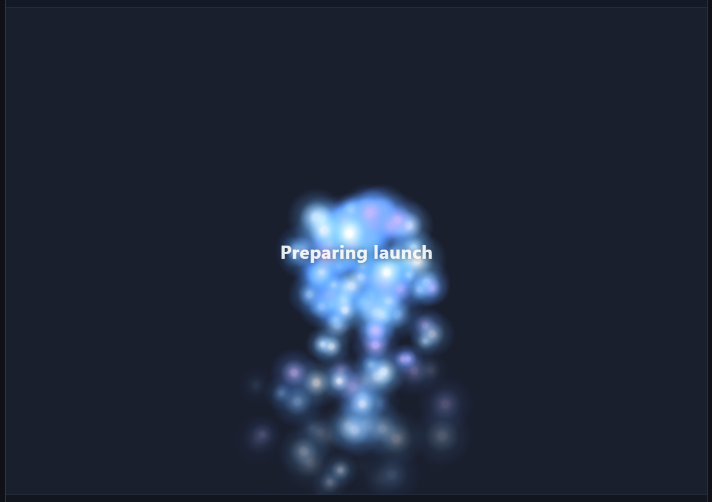
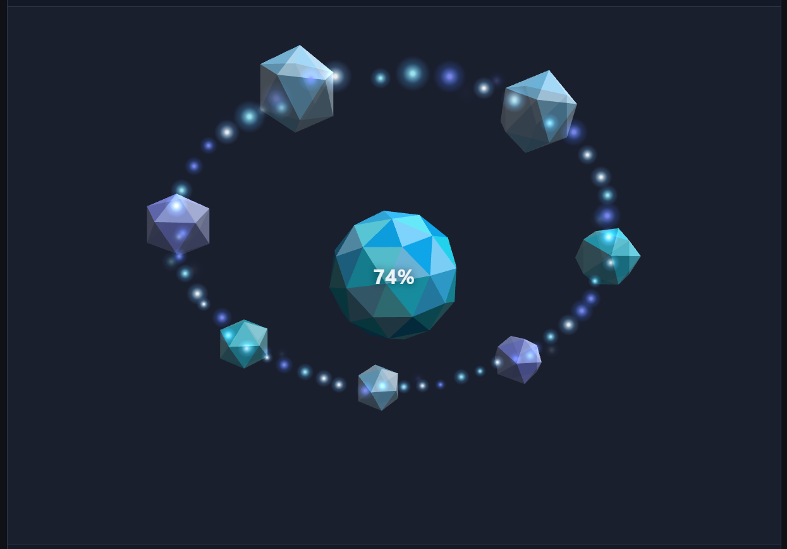
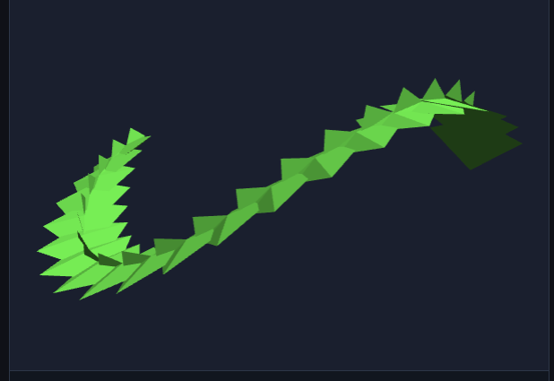

# 3d-spinner-react

[](https://github.com/runelaang/3d-spinner-react/actions/workflows/ci.yml)
[](https://www.npmjs.com/package/3d-spinner-react)
[](LICENSE)

React bindings for [`3d-spinner`](https://www.npmjs.com/package/3d-spinner) - a
zero-dependency 3D spinner, loader, and progress indicator that draws to a
canvas. You get a `<Spinner>` component and a `useSpinner` hook for mounting,
cleanup, and progress. Import the animations and prefabs you need from
`3d-spinner`; only what you import ends up in your bundle.

## Install

```sh
npm install 3d-spinner-react 3d-spinner react
```

`3d-spinner` (>=0.9.3) and `react` (18+) are peer dependencies.

## Screenshots

Some ready-made prefabs from `3d-spinner/prefabs`, shown here through `<Spinner>`:

| `starSwarm` with custom HTML | `pulsingStarfield` | `chargedOrb` at 74% |
| --- | --- | --- |
|  |  |  |

| `ghostTrain` progress prefab | `ParticlesAnimation` with glow texture |
| --- | --- |
|  |  |

## Prefabs

`3d-spinner/prefabs` ships complete setups - layered animation, labels, and
sensible defaults already picked. Import one, pass its `animation` into
`<Spinner>`, and give the container a width and height.

> **Pass `animation` as a factory** (`() => prefab().animation`), not a bare
> instance. Each mount gets a fresh animation - that is what keeps things working
> under StrictMode and when props change.

Indeterminate prefab:

```tsx
import { Spinner } from "3d-spinner-react";
import { starSwarm } from "3d-spinner/prefabs";

function Loading() {
  return (
    <Spinner
      type="indeterminate"
      animation={() => starSwarm({ label: "Just a sec" }).animation}
      style={{ width: 240, height: 240 }}
    />
  );
}
```

Progress prefab - set `progress` from state; at `1` the outro plays:

```tsx
import { useState } from "react";
import { Spinner } from "3d-spinner-react";
import { chargedOrb } from "3d-spinner/prefabs";

function Upload() {
  const [progress, setProgress] = useState(0.74);
  return (
    <Spinner
      progress={progress}
      animation={() => chargedOrb({ label: "Uploading" }).animation}
      style={{ width: 240, height: 240 }}
    />
  );
}
```

You can override `backend`, `label`, `fadeLabel`, and `periodMs`. Labels fade
with the intro and outro by default; set `fadeLabel: false` to keep one fully
visible. Motion prefabs also take `object` and `particles` options. A label can
be plain text or an `HTMLElement`. If your factory closes over a prop, add it to
`deps` so the spinner rebuilds when it changes.

```tsx
import { Spinner } from "3d-spinner-react";
import { planeStarTrail } from "3d-spinner/prefabs";

function LaunchPreview({ rate }: { rate: number }) {
  return (
    <Spinner
      type="indeterminate"
      animation={() =>
        planeStarTrail({ label: "Preparing preview", particles: { rate } }).animation
      }
      deps={[rate]}
      style={{ width: 280, height: 280 }}
    />
  );
}
```

Available prefabs (each at `3d-spinner/prefabs`):

| Export | Mode | Description |
| --- | --- | --- |
| `starSwarm` | indeterminate | Bright star particles around a centered message. |
| `pulsingStarfield` | indeterminate | High-shine particles around a slowly pulsing label. |
| `planeStarTrail` | indeterminate | A small plane looping through a star-particle stream. |
| `monochromeStreak` | indeterminate | Minimal streak motion with particles. |
| `crystalComet` | indeterminate | Comet with a particle tail. |
| `rocketLaunch` | progress | Rocket launch with exhaust particles. |
| `chargedOrb` | progress | Orb that grows satellites as progress climbs. |
| `ghostTrain` | progress | Ice-cube train on a tilted track with a star trail. |
| `gridAssembly` | progress | Grid pieces assemble as progress advances. |

See [`3d-spinner`'s docs](https://www.npmjs.com/package/3d-spinner) for how prefabs
are built, plus custom animations, shapes, motion paths, and rendering backends.

## Quick start

An indeterminate spinner runs until you unmount it. Give the container a width
and height - the canvas fills that box.

```tsx
import { Spinner } from "3d-spinner-react";
import { SpinAnimation } from "3d-spinner/animations/spin";

function Loading() {
  return (
    <Spinner
      type="indeterminate"
      animation={() => new SpinAnimation({ color: "#3b82f6" })}
      style={{ width: 120, height: 120 }}
    />
  );
}
```

## Reporting progress

Leave out `type` (it defaults to `"progress"`) and update `progress` from state.
Changes call `setProgress` without rebuilding the spinner; at `1` the outro plays.
Add `progressAnimation` to `SpinAnimation` if you want it to pop in and scale with
progress.

```tsx
import { useState } from "react";
import { Spinner } from "3d-spinner-react";
import { SpinAnimation } from "3d-spinner/animations/spin";

function Upload() {
  const [progress, setProgress] = useState(0);
  return (
    <Spinner
      progress={progress}
      animation={() => new SpinAnimation({ progressAnimation: {} })}
      style={{ width: 160, height: 160 }}
    />
  );
}
```

## Choosing a shape or animation

This wrapper does not bundle the 3D engine - import shapes and animations from
`3d-spinner` yourself.

```tsx
import { Spinner } from "3d-spinner-react";
import { SpinAnimation } from "3d-spinner/animations/spin";
import { tetrahedron } from "3d-spinner/engines/little-3d-engine";

function Themed({ color }: { color: string }) {
  return (
    <Spinner
      type="indeterminate"
      animation={() => new SpinAnimation({ shape: tetrahedron(), color })}
      deps={[color]}
      style={{ width: 120, height: 120 }}
    />
  );
}
```

Each animation is imported from its own subpath:

| Import | Class | Description |
| --- | --- | --- |
| `3d-spinner/animations/spin` | `SpinAnimation` | A spinning 3D shape, a cube by default. |
| `3d-spinner/animations/object-motion` | `ObjectMotionAnimation` | A mesh that follows a motion path, with an intro/outro you choose. |
| `3d-spinner/animations/particles` | `ParticlesAnimation` | Camera-facing billboard particles: burst, fountain, snow, confetti. |
| `3d-spinner/animations/charged-orb` | `ChargedOrbAnimation` | Progress-driven orb with satellite pop-outs. |
| `3d-spinner/animations/grid-assembly` | `GridAssemblyAnimation` | Grid pieces that assemble with progress. |

Shapes exported from `3d-spinner/engines/little-3d-engine` include `cube`,
`tetrahedron`, `octahedron`, `pyramid`, `quad`, and several spheres (`uvSphere`,
`icosphere`, `octaSphere`, `cubeSphere`).

## The `useSpinner` hook

Use the hook when you already have a container ref or want to call
`stop()` / `setProgress()` from code. It returns a stable handle.

```tsx
import { useRef } from "react";
import { useSpinner } from "3d-spinner-react";
import { starSwarm } from "3d-spinner/prefabs";

function ManualControl() {
  const ref = useRef<HTMLDivElement>(null);
  const spinner = useSpinner(ref, {
    type: "indeterminate",
    animation: () => starSwarm().animation,
  });

  return (
    <>
      <div ref={ref} style={{ width: 240, height: 240 }} />
      <button onClick={() => spinner.stop()}>Stop</button>
    </>
  );
}
```

The `<Spinner>` component forwards a ref to the same handle:

```tsx
const ref = useRef<SpinnerHandle>(null);
<Spinner ref={ref} animation={() => new SpinAnimation()} /* ... */ />;
ref.current?.stop();
```

## API

### `<Spinner>`

A `div` that hosts the spinner. Takes the options below plus normal `div` props
(`className`, `style`, `aria-*`, ...). Defaults to `position: relative` and
**needs a size** - with no height, you get a blank 0x0 canvas.

### `useSpinner(targetRef, config, deps?)`

Mounts a spinner into `targetRef.current` and keeps it in sync. Returns a
`SpinnerHandle`.

### Options (`SpinnerConfig`)

| Option | Type | Description |
| --- | --- | --- |
| `animation` | `SpinnerAnimation \| () => SpinnerAnimation` | The visual to play. Prefer a factory. Required. |
| `type` | `"progress" \| "indeterminate"` | Mode. Default `"progress"`. |
| `progress` | `number` | Progress `0..1` (progress mode). Reactive. |
| `timeout` | `number` | Auto-complete after this many ms (progress mode). |
| `until` | `Date` | Auto-complete at this time (progress mode). |
| `loop` | `"bounce" \| "restart"` | Loop style (indeterminate mode). Default `"bounce"`. |
| `periodMs` | `number` | Ms for one sweep (indeterminate mode). Default `2000`. |
| `deps` | `DependencyList` | Extra rebuild triggers for values captured in an `animation` factory. Default `[]`. |

Structural options (`type`, `loop`, `periodMs`, `timeout`, `until`) rebuild the
spinner automatically when they change. `progress` is applied without a rebuild.

### `SpinnerHandle`

| Method | Description |
| --- | --- |
| `setProgress(target)` | Advance progress toward `target` (`0..1`). No-op when indeterminate. |
| `stop()` | Play the outro, then stop. Keeps the element. |
| `destroy()` | Stop now and remove the element. Called automatically on unmount. |

## Requirements

React 18+. The spinner draws to a canvas, so it only runs in the browser - not
during SSR. It mounts in a client effect after hydration.

The package is marked `"use client"`, so in Next.js App Router you can import
`<Spinner>` without adding your own client wrapper.

## Development

```sh
npm install
npm run build      # compile src/ to dist/ (ESM + type declarations)
npm run typecheck  # type-check without emitting
npm test           # build, then run the unit tests
```

## License

MIT (c) Rune Laang
